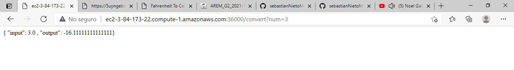
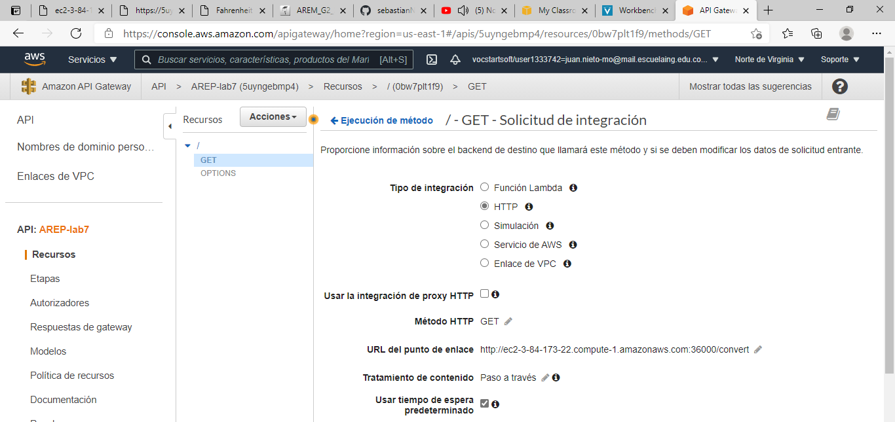
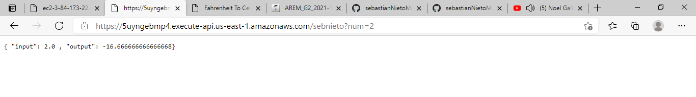
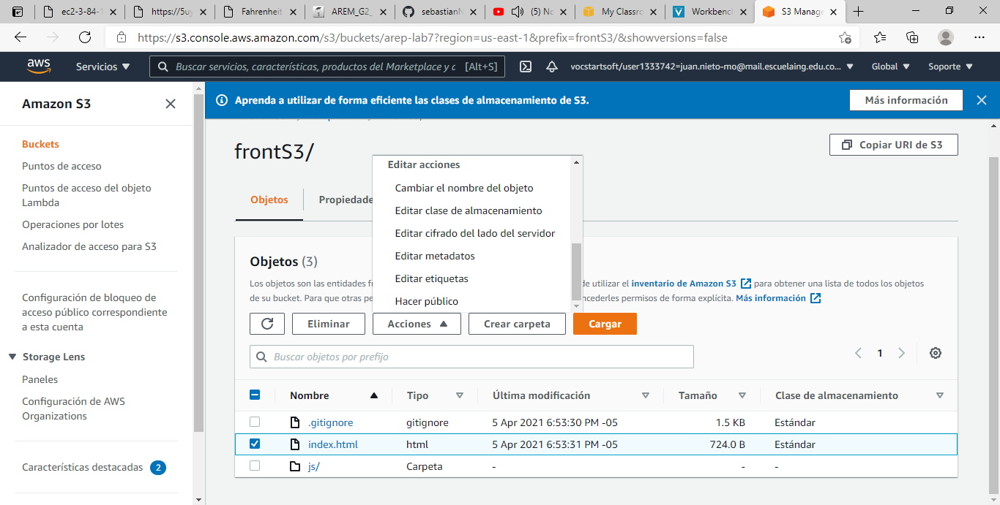
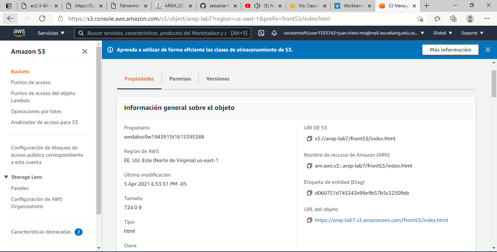
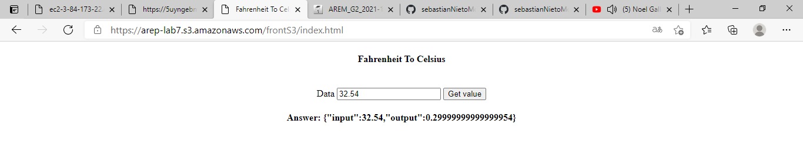

# AREP-lab7

Link video youtube.

[Video](https://www.youtube.com/watch?v=A07O_olfH70)

# TAREA DE AMAZON GATEWAY Y LAMBDA

Este proyecto busca implementar un servicio web en sapark el cual pueda utilizar un servicio de AWS llamado EC2, por medio de una imagen docker. El servicio API Gateway debe consumir el servicio de EC2 y mostrar de igual forma el funcionamiento de EC2. Finalmente, debemos crear un servicio S3 que consuma el servicio de API Gateway y mostrar su funcionamiento por medio de una pagina creada con js.

## Comenzando 🚀

_Estas instrucciones te permitirán obtener una copia del proyecto en funcionamiento en tu máquina local para propósitos de desarrollo y pruebas._

### Pre-requisitos 📋

Para poder hacer uso de este proyecto se debe tener instalado:
 
  * MVN
  * Git
  * Java 8
  * Docker, Si desea probar el proyecto localmente o si desea usarlo en EC2
  * Tener créditos para poder usar los servicios de AWS

### Instalación 🔧

Lo primero que debe hacer es descargar el proyecto, lo pude hacer directamente descargando el .zip, o puede clonar el archivo con el siguiente comando.

```
https://github.com/sebastianNietoMolina/AREP-lab7.git
```

Entramos al directorio del proyecto con el comando

```
cd AREP-lab7
```

Luego debe ingresar el siguiente comando para que se ejectue hasta la fase de empaquetamiento, debe asegurar que antes de ingresar este comando, que exista en la carpeta que esta un archivo llamado pom.xml

```
mvn clean install package
```

Tambien me gustaria aclarar que puedes descargar el javaDoc, este quedara guardado en una carpeta target, esta se genera una vez echo el comando anterior, y con el siguiente comando se creara la carpeta site, la ruta sera target/site.

```
mvn javadoc:javadoc
```

Si deseas ver como crear las imágenes en docker puedes hacerlo de la siguiente forma.

```
docker build -t nombreDeLaImagen .
```

Puede verificar que la imagen se haya creado con el comando

```
docker images
```

Luego vamos a crear un contenedor para poder ver nuestro proyecto corriendo localmente, debe tener en claro que el puerto 35000 es opcional, puede puede el que desee.

```
docker run -d -p 35000:6000 --name nombreDeLaImagenCreadaEnELPasoAnterior nombreDelContenedor
```

Ahora si desea crear la imagen en EC2, use el siguiente comando, al igual que el paso anterior el puerto 36000 es opcional, pero debe habilitarlo anteriormente, y en mi repositorio en docker hub existe la imagen juanmol/convert.

```
docker run -d -p 36000:6000 --name nombreDelContenedor juanmol/convert
```

Podrá ver lo siguiente.



Ahora debe generar el API Gateway, para ello debe crear el servicio y posteriormente hacer la siguiente configuración.



Después de eso, debe desplegar el API y podrá ver la siguiente página.



Finalmente debemos generar el s3, para ello, debemos hacer la siguiente configuración y se desplegara automáticamente.

Primero debemos subir los archivos y debemos hacer publico el index.html



Luego abrimos dando clic sobre index.html y ahí nos la url para abrir la página.



Finalmente podemos ver lo siguiente.




## Autores ✒️

_Menciona a todos aquellos que ayudaron a levantar el proyecto desde sus inicios_

* **Sebastian Nieto** - [sebastianNieto](https://github.com/sebastianNietoMolina)

## Licencia 📄

Este proyecto está bajo la Licencia MIT - mira el archivo [LICENSE.md](LICENSE.md) para detalles

## Expresiones de Gratitud 🎁

Reconocimientos a: [Villanuevand](https://github.com/Villanuevand), use su plantilla de README.md.

